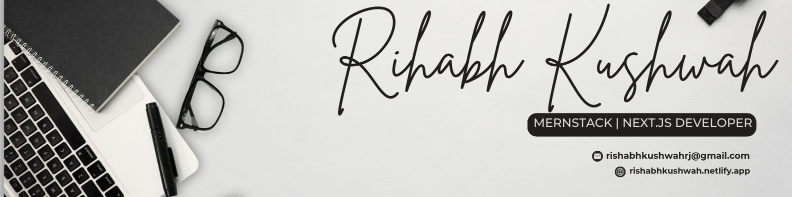

# 💻 Rishabh Kushwah

Hi there! I'm **Rishabh Kushwah**, a passionate Web Developer from Indore, India 🇮🇳.

- 🔭 Expertise  on **MERN stack** and exploring **Next.js** for advanced web applications.
- ⚡ I love building web apps, automating my Linux workflow, and Improving my Hyprarch ( archlinux + hyprland) setup.

# My Personal Portfolio

🚀 You can explore my complete portfolio on my [Portfolio](https://rishabhkushwah.netlify.app/), where you'll find live demos, details about my projects, and more about me.

### Projects

- **Shoes Store**: An e-commerce web app showcasing a modern UI for browsing and purchasing footwear. Built with MERN stack technologies for smooth user experience and dynamic product handling.

- **Blog App**: A full-featured blogging platform allowing users to create, edit, and read posts. Focuses on clean design, rich text editing, and seamless navigation.

- **Advance Quiz App**: Stay tuned for updates on this exciting project! More information coming soon.

Feel free to check out my portfolio for a more in-depth look at my work and stay updated on my projects. Let's connect and discuss our shared passion for technology!

#  My Skills 🛠

This is skills that i have and tried to improve it and aquired more

### Basics 

### Programming Language 

### CSS FreamWork & Libraries

### Javascript Libraries 

### Database

### Others

### Tools & Platform

# 🔗 Other Profiles

